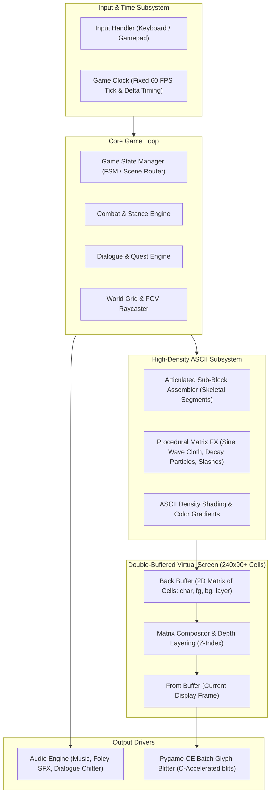

# ⚔️ ASCII Medieval RPG Engine

> A high-fidelity medieval role-playing game rendered entirely through dynamic ASCII glyph matrices, driven by procedural character manipulation, intricate combat mechanics, and synchronized audio.

---

## 1. Project Overview & Vision

This project is a medieval dark fantasy RPG rendered entirely through a **High-Density ASCII / Micro-Glyph Engine**. 

Rather than relying on low-resolution, chunky roguelike tiles or simplistic stick figures, the engine treats **thousands of tiny monospace characters as high-density graphical cells** (reminiscent of projects like *Stone Story RPG* or high-fidelity ASCII demoscene art). On a 1080p display, the canvas utilizes micro-pixel fonts (e.g., 6×10 or 8×12 pixels) to pack **20,000 to 35,000+ simultaneous character cells** across the screen.

At this density, ASCII art achieves extraordinary visual richness: intricate gothic plate armor, detailed anatomies, weathered stone architecture, dynamic cloth physics, and atmospheric lighting—all rendered through alphanumeric characters, punctuation marks, and Unicode shading blocks.

### Core Pillars
1. **High-Density Micro-ASCII Canvas**: High cell count (`240×90` to `320×108` grid) allowing fine contour lines, anatomical detail, and intricate cross-hatching.
2. **Articulated Sub-Block Animations**: Characters are decomposed into modular sub-blocks (helm, torso, greatsword, flowing cloak) transformed procedurally via mathematical functions.
3. **Procedural Shading & Density Ramps**: Dynamic illumination (torches, magical glows) computed via ASCII density ramps (`. : - = + * # % @`) and Unicode shade glyphs (`░ ▒ ▓ █`).
4. **Intricate Tactical Combat**: Kinetic medieval dueling with localized hit zones, posture meters, parry windows, and dramatic slash frames.
5. **Synchronized Audio & Dialogue**: Full atmospheric soundscapes, Foley combat SFX, and pitch-modulated typewriter speech synthesis.

---

## 2. Display Architecture: Terminal vs. Dedicated Window

A critical foundational decision is how the ASCII world is presented to the player.

| Criteria | Terminal Mode (CLI / ANSI Escape Codes) | Dedicated Monospace Window (Virtual Grid) |
| :--- | :--- | :--- |
| **Grid Resolution** | Typically restricted to 80×24 or 120×40; scaling causes wrapping or severe distortion | **High-Density Canvas**: Native 1920×1080 window hosting `240×90` to `320×108` micro-cells |
| **Rendering Method** | Standard stdout stream using ANSI cursor positioning (`\x1b[y;xH`) | Hardware-accelerated window (SDL2 via `pygame-ce`) blitting cached glyph textures |
| **Frame Rate & Flicker** | Prone to severe tearing, dropped frames, and cursor flickering at high cell counts | **Locked 60 FPS** double-buffered blitting with sub-millisecond frame compositing |
| **Color Fidelity** | Dependent on player terminal emulator support (8-color, 256-color, or 24-bit TrueColor) | Guaranteed **24-bit RGB TrueColor** per cell + background shading + alpha/glow tinting |
| **Typography & Scaling** | Bound to user's terminal font settings; square aspect ratios are rare; line spacing varies | Bundled custom monospace pixel font (e.g., *Fixedsys*, *Consolas*, *Proggy*, *IBM VGA*); consistent aspect ratio and crisp DPI scaling |
| **Audio Integration** | Terminals have no native audio; requires spawning detached background audio libraries | Seamless, low-latency audio engine running inside the main game loop |
| **Post-Processing** | None possible | Optional CRT scanlines, chromatic aberration, subtle bloom, and camera screenshake |

### 💡 Recommendation: Dedicated Monospace Window (Virtual Grid)
We use a **Dedicated Monospace Window** powered by `pygame-ce`. The engine operates entirely on an abstract **2D Character Matrix**, while the window renderer ensures razor-sharp micro-font rendering, 60 FPS performance across tens of thousands of cells, and synchronized audio.

---

## 3. System Architecture & Engine Pipeline



---

## 4. Fundamental Engine Mechanics

### 4.1 The High-Density Virtual Cell Grid
The screen is represented by a high-resolution discrete 2D matrix (e.g., `240 columns × 90 rows` = 21,600 cells at 8×12 font on a 1920×1080 display):

```text
+---------------------------------------------------------------------------------------------------+
| [Cell(0,0)]   [Cell(1,0)]   [Cell(2,0)]   ...   [Cell(238,0)]   [Cell(239,0)]                     |
| [Cell(0,1)]   [Cell(1,1)]   [Cell(2,1)]   ...   [Cell(238,1)]   [Cell(239,1)]                     |
| ...                                                                                               |
| [Cell(0,89)]  [Cell(1,89)]  [Cell(2,89)]  ...   [Cell(238,89)]  [Cell(239,89)]                    |
+---------------------------------------------------------------------------------------------------+
```

Each `Cell` in memory consists of:
- `glyph`: Monospace character string (ASCII `32..126` or Unicode box/shade `░ ▒ ▓ █ ▀ ▄`).
- `fg_color`: RGB tuple `(R, G, B)` for glyph tint.
- `bg_color`: RGB tuple `(R, G, B)` for cell background.
- `layer`: Integer Z-index for compositing (Terrain, Props, Actors, Effects, Overlay UI).

---

### 4.2 High-Density ASCII Sprites & Articulated Animation

At high resolution, characters and monsters are **detailed multi-line character matrices** rather than 1-tile symbols:

```text
                    .---.
                   /_____\
                  |  o.o  |  <- [Head Sub-Block]
                 / \  -  / \
               .'   '---'   '.
              /  | [=====] |  \   <- [Torso & Pauldron Sub-Block]
             |   |  |:::|  |   |
      ====[]=|===|==|:::|==|===|====>  <- [Greatsword Sub-Block (Rotatable / Slashing)]
             |   |  |:::|  |   |
              \  |  |:::|  |  /
               '._\_|:::|_/_.'
                   /     \       <- [Legs / Tassets Sub-Block]
                  |  / \  |
                  | |   | |
                 (_/     \_)
```

#### Procedural Animation Primitives for High-Density Blocks:
1. **Articulated Sub-Block Transformations**:
   - Complex entities are split into independent segments (e.g., weapon, torso, arms, flowing cloak).
   - Each segment can be shifted, rotated along discrete angular glyph lookup tables, or bobbed independently to create breathing, weapon stances, and recoil.
2. **Sine-Wave Cloth & Fluid Distortion**:
   - Applied horizontally or vertically across block slices:
     $$\Delta x = \text{round}\left(A \cdot \sin(\omega \cdot y + \phi \cdot t)\right)$$
   - Creates organic flowing capes, rippling dungeon water, flickering campfires, and trembling spectral apparitions.
3. **Density-Ramp Shading & Dynamic Lighting**:
   - Light sources (torches, moonlight, fireballs) cast radial brightness over the character grid.
   - Cells adjust their glyph density and color intensity based on distance using luminance ramps:
     ```text
     " .:-=+*#%@"  (Ascending density ramp)
     " ░▒▓█"        (Unicode smooth volumetric ramp)
     ```
4. **Cellular Decay / Disintegration (Magic & Death FX)**:
   - High-density blocks dissolve through a decaying cellular automaton, scattering characters into drifting ash particles (`*`, `.`, `'`, `,`) over time.
5. **Kinetic Slash Lines & Shockwaves**:
   - High-velocity weapon swings trace Bresenham lines through the grid with razor-sharp diagonal glyphs (`/`, `\`, `—`, `|`) in bright gold/silver, fading into smoke.


---

### 4.3 Audio & Dialogue Engine
- **Sound Effects (SFX)**: Frame-synchronized triggers for sword parries, shield bashes, footsteps, door creaks, and environmental weather.
- **Typewriter Dialogue with Voice Modulation**:
  - Text is revealed glyph-by-glyph with customizable speeds.
  - Every character revealed triggers a tiny audio blip with randomized or character-specific pitch shifting (creating distinct vocal personalities without full voice acting).
- **Layered Ambience & Music**:
  - Continuous background loops (dungeon wind, rain, tavern lute music) with smooth volume crossfading between exploration and combat.

---

### 4.4 Intricate Combat System
Instead of simple stat rolling, combat operates on strategic timing and spatial feedback:
- **Body Part Targeting & Posture**: Enemies have posture meters and distinct zones (Head, Torso, Weapon Arm, Legs). Depleting posture triggers a stagger frame.
- **Visual Attack Telegraphs**: Enemy intent is visualized through flashing character blocks (e.g., an enemy knight's spear tip glows `!` before lunging).
- **Reaction Windows**: Player can Dodge, Parry, or Counter-thrust within specific animation frames.
- **Kinetic Hit Feedback**: Flash frames where hit characters invert their colors (white-on-black becomes black-on-white) and shake horizontally.

---

## 5. Technology Stack & Runtime Specification

The engine is built on **Python 3 (3.10+)** utilizing **`pygame-ce` (Pygame Community Edition)** as the lightweight window, input, and audio driver.

### Why Python + `pygame-ce`?
- **Active & Modern Runtime**: `pygame-ce` is the actively maintained community fork of Pygame, offering superior SDL2/SDL3 performance, improved font rendering speed, and low-latency audio mixing.
- **Rapid Prototyping for Block Math**: Python's slicing, 2D list comprehensions, and data structures allow rapid iteration of procedural block animation algorithms without recompilation overhead.
- **Robust Audio Subsystem**: `pygame.mixer` provides dedicated multi-channel sound management, background streaming music, and the low-latency channel triggers needed for typewriter voice blips.
- **Cross-Platform Portability**: Runs natively on Windows, macOS, and Linux without platform-specific graphics plumbing.

### High-Density Grid Performance Strategy (20,000–35,000+ Cells)
Rendering 30,000 text characters every frame in Python could be slow if done naively. We engineer for locked 60 FPS using three architectural techniques:
1. **Pre-Baked Glyph Atlas**: All ASCII & Unicode glyphs are pre-rasterized at boot into a cached surface atlas. Zero runtime font rasterization occurs during gameplay.
2. **C-Accelerated Batch Blitting (`Surface.blits()`)**: Pygame-CE provides a C-level batch blitter (`surface.blits(blit_sequence)`), capable of blitting tens of thousands of character quads in ~1.2 milliseconds.
3. **Dirty-Cell Matrix Diffing**: The compositor maintains the previous frame's buffer and only blits cells whose character, foreground color, or background color changed. Static backgrounds, dungeon walls, and UI borders cost 0ms per frame.


### Environment Setup & Requirements
```bash
# 1. Clone repository & navigate to directory
cd ASCII-game

# 2. Create and activate virtual environment
python -m venv venv
# On Windows PowerShell:
.\venv\Scripts\Activate.ps1
# On Linux/macOS:
source venv/bin/activate

# 3. Install engine dependencies
pip install pygame-ce Pillow

# 4. Launch High-Density Character Workbench & Stance Viewer
python viewer.py
# Or open viewer.html in any web browser!
```

---

## 6. Character Design Workbench & Stance System

The hero character (**The Knight**) features a high-density micro-glyph architecture with seamless real-time stance switching between **Rest Stance** and **Combat Stance** via the **`Z`** key:

- **Rest Stance (Standing Sentinel)**:
  - Symmetrical upright posture with two-handed greatsword tip planted firmly into the flagstone.
  - Inverted pendulum heavy armor breathing sway ($\omega = 1.2$ rad/s) and gentle cloth wind ripple.
- **Combat Stance (Attack Ready)**:
  - Wide athletic battle stance with two-handed greatsword raised diagonally across the torso ready to strike.
  - Spring-loaded side-to-side athletic battle bounce ($\omega = 2.8$ rad/s), knee flex/dip, weapon dynamic inertia lag, and accelerated gale-force cape flutter.
- **Viewing Interfaces**:
  - **`viewer.py`**: Native hardware-accelerated SDL2 window (`pygame-ce`) running at 60 FPS with live hit-zone inspector, real-time font density scaling (4px–18px), and palette switching.
  - **`viewer.html`**: Zero-dependency Web Canvas viewer with interactive pan/zoom and `[Z]` stance switching.
  - Full design workbench documentation: [knight_design.md](file:///c:/Users/Asus/Desktop/Creative%20Work%20and%20ideas/Ascii%20game/ASCII-game/knight_design.md).

---

## 7. Project Architecture Plan

```text
ASCII-game/
├── assets/
│   ├── ascii/              # Raw ASCII art templates (.txt / .json)
│   │   ├── monsters/       # Enemy sprite blocks
│   │   ├── items/          # Weapon and armor art
│   │   ├── environments/   # Trees, castles, dungeon rooms
│   │   └── ui/             # Borders, banner headers, dialogue boxes
│   ├── audio/
│   │   ├── sfx/            # Combat, footsteps, UI sounds (.wav / .ogg)
│   │   ├── music/          # Ambient soundtracks
│   │   └── voices/         # Phoneme chiptunes / dialogue blips
│   └── fonts/              # Monospace TTF pixel fonts
├── engine/
│   ├── core/
│   │   ├── window.py       # Monospace grid display window
│   │   ├── buffer.py       # Virtual 2D character matrix & double-buffer
│   │   └── time.py         # Tick-rate controller & delta timing
│   ├── renderer/
│   │   ├── compositor.py   # Multi-layer Z-ordering & clipping
│   │   ├── effects.py      # Sine wave, dissolve, particles, screen shake
│   │   └── color.py        # Color palettes, lerp, and lighting falloff
│   └── audio/
│   │   └── sound_system.py # Audio channel manager & typewriter blip synth
├── game/
│   ├── entities/           # Player, NPCs, Enemies
│   ├── combat/             # Combat state machine, posture, parry windows
│   ├── dialogue/           # Typewriter text engine & branch trees
│   └── world/              # Map representation & collision grid
├── main.py                 # Entry point
└── README.md
```

---

## 7. Development Roadmap

- [ ] **Phase 1: Virtual Display & Grid Buffer**
  - Implement the 2D cell matrix (`char`, `fg`, `bg`).
  - Create the monospace window renderer with customizable font and resolution.
  - Implement double-buffering and fixed 60 FPS tick loop.

- [ ] **Phase 2: ASCII Block & Animation Primitives**
  - Build the block parser (import multiline ASCII art into coordinate matrices).
  - Implement translation, transparency masks, and sine-wave distortion.
  - Implement particle decay and combat slash effects.

- [ ] **Phase 3: Audio & Typewriter Dialogue**
  - Integrate sound mixer with multi-channel playback.
  - Build the dialogue window with typewriter character reveals and synchronized pitch-modulated audio blips.

- [ ] **Phase 4: Combat Prototype**
  - Build turn/tick-based encounter arena.
  - Implement attack telegraphing, defense reactions (parry/dodge), and impact animations.

- [ ] **Phase 5: World Exploration & Polish**
  - Dungeon/overworld grid navigation with field-of-view (FOV) ASCII lighting.
  - State management for inventory, quests, and storyline progression.